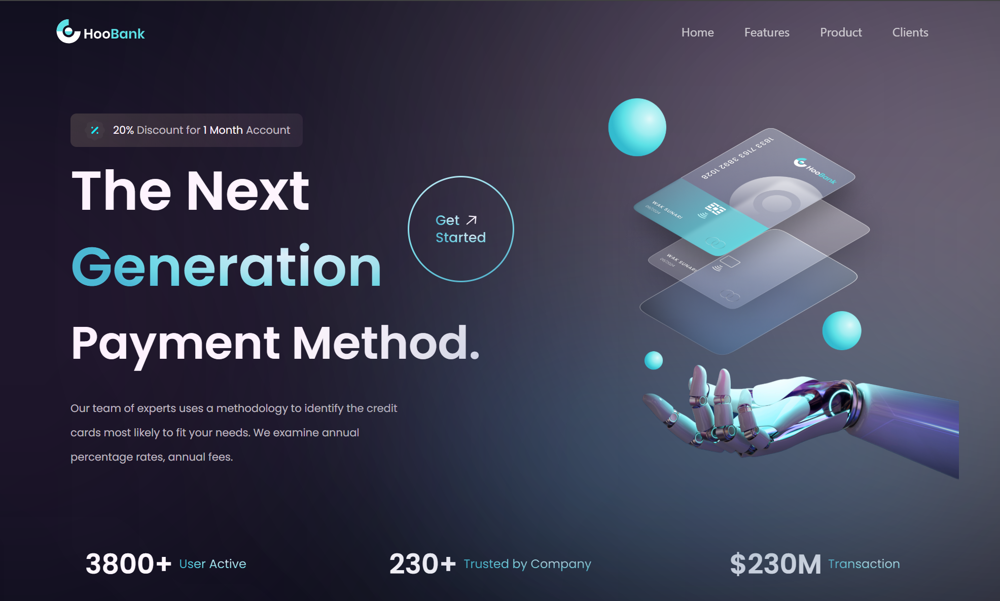

<div align= "center">

<hr>
</div>

<div align="center">
<a href="https://github.com/SorayuthJapanya/Practice-Frontend-Development/tree/main/bank_moder_app" target="blank">

</a>

<h2> Project Name : Bank Modern Web Responsive App </h2>




</div>

## 💡 Overview

A Frontend Development **Bank Modern Web Responsive App** built with the **React.Js** (TypeScript).  

## ✨ Features

- Responsive landing page for a modern bank app
- Sticky navbar with smooth scroll
- Animated counters (triggered when in view)
- Infinite scrolling client carousel
- Gradient buttons & hover effects
- Blur + glassmorphism navbar
- Clean project structure for scalability

## 👩‍💻 Tech Stack

- **React + Vite** – Fast frontend setup
- **Tailwind CSS v4** – Utility-first CSS framework
- **Framer Motion** – Smooth animations and transitions
- **TypeScript** – Type safety

**Deployment** - Frontend → [Vercel](https://practice-frontend-development.vercel.app)


## 📦 Getting Started

To get a local copy of this project up and running, follow these steps.

### 🚀 Prerequisites

- **Node.js** (v16.x or higher) and **npm** or **pnpm**.
- **Pnpm** If you prefer using npm for package management and running scripts.

## 🛠️ Installation

1.  **Clone the repository:**

    ```bash
    git clone https://github.com/SorayuthJapanya/Practice-Frontend-Development.git
    cd Practice-Frontend-Development/bank_moder_app
    ```

2.  **Setup Backend (React + Vite + Typescript):**

    Using Pnpm & Start the development client:

    ```bash
    pnpm install
    pnpm run dev
    ```

    This Website will run on: `http://localhost:5173`

## 📖 Usage

### ✔ Running the Website

- **Development mode:** `npm run dev`, `pnpm run dev`, `yarn dev`, or `bun dev`.
- **Production mode:** `npm run build && npm start`, `pnpm run build && pnpm start`, `yarn build && yarn start`, or `bun run build && bun start`.

> Open [http://localhost:5173](http://localhost:5173) to view the app in your browser.


## 🤝 Contributing

Pull requests are welcome! For major changes, please open an issue first to discuss.

## 📜 License

This project is for learning and practice purposes. Feel free to use it as a reference or starting point.
